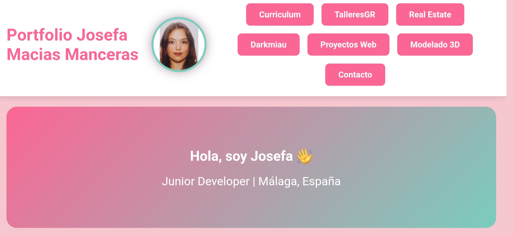
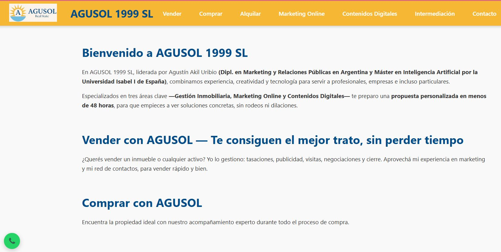
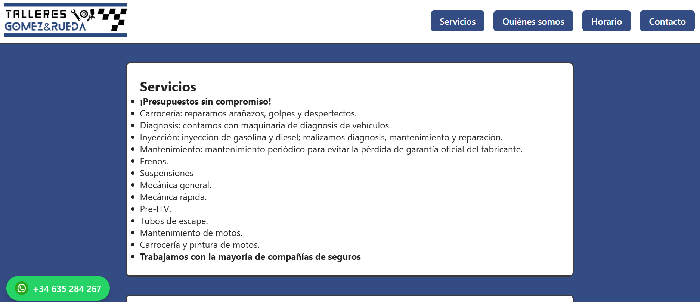

<h1 align="center">✨ ¡Hola! Soy Saldyard 👋</h1>

  🚀 <b>Frontend Developer</b> | Aprendiendo<b> cada día</b> algo<b> nuevo</b>  

---

## 🚀 Proyectos Destacados

  
  
  

---

## 🛠️ Tecnologías & Herramientas

  
  
  
  

---

## 📫 Conecta Conmigo

---

🌸 Gracias por visitar mi perfil 🌸

